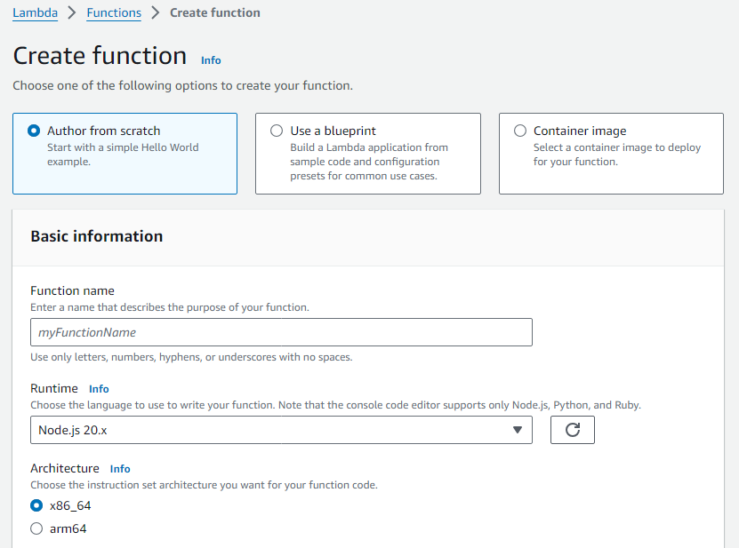
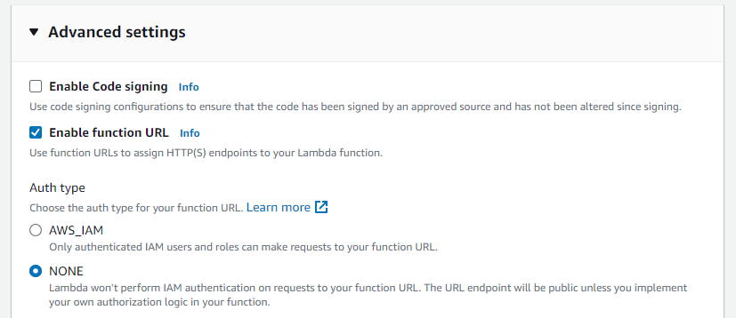

## 챗GPT API 적용된 운세보는 챗도지 웹 서비스 만들기 - 조코딩

## 목차

- [Section 1 - 시작](#section-1---시작)
  - [ChatGPT](#chatgpt)
- [Section 2 - BE 구축하기](#section-2---be-구축하기)
  - [Node.js로 ChatGPT API 구현하기](#nodejs로-chatgpt-api-구현하기)
  - [Express로 BE 서버 구축하기](#express로-be-서버-구축하기)
- [Section 3- FE 구축하기](#section-3--fe-구축하기)
  - [BE 서버와 연결하기](#be-서버와-연결하기)
  - [채팅 UI](#채팅-ui)
- [Section 4 - 기능 고도화](#section-4---기능-고도화)
- [Section 5 - 배포하기](#section-5---배포하기)
  - [FE 배포](#fe-배포)
  - [BE 배포](#be-배포)


# [Section 1 - 시작](#목차)

- [ChatGPT](#chatgpt)

## [ChatGPT](#section-1---시작)

생성하는 사전 학습된 트랜스포머  
GPT(Generative Pretrained Transfomer)

### ChatGPT Playground

SYSTEM: ChatGPT 역할 부여  
USER: 유저 채팅  
ASSISTANT: chatGPT  

Temperature: 무작위성 
- 낮으면 같은 답변이 나올 확률이 높음  
- 의학적 지식 등은 랜덤한 답변이 나오면 좋지 않음 (잘 조절)  

Maximum length: 답변 길이  
- 최대 2048개의 토큰까지(언어에 따라 다름)

Top P: 상위 확률 단어    
- 각 결과 값이 나올 확률을 Top P 까지 누적 합 했을 때
- 그 안에서 랜덤하게 선택 (Top P=1이면 모든 결과 중 랜덤하게 -> 엉뚱한 결과까지)

Frequency penalty: 빈도 패널티    
- 계속 등장하는 단어에 패널티를 부여 (낮으면 같은 문장이 반복)

Presence penalty: 존재 패널티
- 계속 등장하는 답변에 패널티를 부여

---

시스템에서 역할을 먼저 부여하고, 유저로 한번 더 인식 -> 프롬프트 엔지니어


# [Section 2 - BE 구축하기](#목차)

- [Node.js로 ChatGPT API 구현하기](#nodejs로-chatgpt-api-구현하기)
- [Express로 BE 서버 구축하기](#express로-be-서버-구축하기)

## [Node.js로 ChatGPT API 구현하기](#section-2---be-구축하기)

backend 폴더 생성 후 `index.js` 생성

https://www.npmjs.com/package/openai  

```sh
npm install openai
```

```js
// import OpenAI from 'openai';
const OpenAI = require("openai");

const openai = new OpenAI({
  apiKey: process.env['OPENAI_API_KEY'],
});

async function apiCall() {
  const chatCompletion = await openai.chat.completions.create({
    model: 'gpt-3.5-turbo',
    max_tokens: 100,
    temperature: 0.5,
    messages: [
      { role: 'system', content: '당신은 세계 최고의 ... 입니다. 어떤 대답도 할 수 있다...' },
      { role: 'user', content: '당신은 세계 최고의 ... 입니다. 어떤 대답도 할 수 있다...' },
      { role: 'assistant', content: '위에까지 하고 assistant 답변 결과를 붙여넣기' },
      { role: 'user', content: '입력 값 ex) 오늘의 운세가 뭐야?' },
    ],
  });
  console.log(chatCompletion.choices[0].message);
}

apiCall();
```

system, user, assistant 이 구조로 만든 후 역할 부여하기

```sh
node index.js
```


## [Express로 BE 서버 구축하기](#section-2---be-구축하기)

https://www.npmjs.com/package/express

Express란?   
**가장 기본적인 Node.js에서 서버를 만드는 프레임워크**

Express를 이용해서 웹 서버를 만듦  
프론트에서 요청하면 실행해서 돌려주는 형태

```sh
npm install express
```

```js
const express = require('express') // express 불러오기
const app = express()

app.get('/', function (req, res) {
  res.send('Hello World')
})

app.listen(3000)
```

express 불러와서 app으로 만든 후  
get 요청이 오면 3000 포트에 'Hello World"를 돌려준다는 뜻

실행 후 `localhost:3000` 접속

라우트 메소드  
https://expressjs.com/ko/guide/routing.html

```js
// GET method route
app.get('/', function (req, res) {
  res.send('GET request to the homepage');
});

// POST method route
app.post('/', function (req, res) {
  res.send('POST request to the homepage');
});
```

get 요청은 주소 창에 대화 내용이 담겨 너무 길어지므로  
post 요청으로 받기 (body 값을 줘야 함)

```js
var express = require('express')

var app = express()

app.use(express.json()) // for parsing application/json
app.use(express.urlencoded({ extended: true })) // for parsing application/x-www-form-urlencoded

app.post('/profile', function (req, res, next) {
  console.log(req.body)
  res.json(req.body)
})
```

프론트엔드에서 요청을 하는데  
그 요청이 json 형태로 들어왔을 때 받으려면 `app.use`

근데 그냥 프론트에서 요청하면 CORS 이슈가 있음   

```js
var cors = require('cors')

// CORS 이슈 해결
let corsOptions = {
    origin: 'https://chatdoge-yuseongmin.pages.dev',
    Credential: true
}
app.use(cors());
```

CORS(Cross-Origin Resource Sharing)  
'CORS 정책을 지킨 리소스 요청'

cors  
아무데서나 오는 요청을 다 허용하면 보안에 취약함  
어디에서 요청이 왔는지 확인해줌


# [Section 3- FE 구축하기](#목차)

- [BE 서버와 연결하기](#be-서버와-연결하기)
- [채팅 UI](#채팅-ui)


## [BE 서버와 연결하기](#section-3--fe-구축하기)

front 폴더 생성 후 `index.html` 생성

fetch라는 요청을 날린 후 응답을 받아서 프론트엔드에 표시

https://developer.mozilla.org/ko/docs/Web/API/Fetch_API/Using_Fetch


```html
<button onclick="getFortune()">요청하기</button>

<script>
  async function getFortune(data) {
    try {
      const response = await fetch("http://localhost:3000/fortuneTell", {
        method: "POST",
        headers: {
          "Content-Type": "application/json",
        },
        body: JSON.stringify(data),
      });

      const data = await response.json();
      console.log("성공:", data);
    } catch (error) {
      console.error("실패:", error);
    }
  }
</script>
```

```html
<button onclick="getFortune()">요청하기</button>

<script>
  async function getFortune() {
    try {
      const response = await fetch("http://localhost:3000/fortuneTell", {
        method: "POST",
        headers: {
          "Content-Type": "application/json",
        },
        body: JSON.stringify(data),
      });

      const data = await response.json();
      console.log("성공:", data);
    } catch (error) {
      console.error("실패:", error);
    }
  }
</script>
```

FE에서 json으로 받아오므로 BE에서 결과 값을 json으로 변환

```js
app.post('/fortuneTell', async function (req, res) {
  // res.send(fortune);
  res.json({"assistant": fortune});
});
```

Live Server 인스텐션을 이용하면 프론트엔드 서버를 볼 수 있음  
요청하기 버튼을 누르면 콘솔 창에서 결과를 확인할 수 있음


## [채팅 UI](#section-3--fe-구축하기)

codepen에는 다양한 채팅 ui가 있음  

https://codepen.io/

```css
    <style>
        body {
          ...
        }
        .chat-box {
          ...
        }
    </style>
```

```js
    <script>
        const chatBox = document.querySelector('.chat-box');

        const sendMessage = async () => {
            const chatInput = document.querySelector('.chat-input input');
            const chatMessage = document.createElement('div');
            chatMessage.classList.add('chat-message');
            chatMessage.innerHTML = `
              <p>${chatInput.value}</p>
            `;
            chatBox.appendChild(chatMessage);
            chatInput.value = '';

            const response = await fetch('your-api-url', {
                method: 'POST',
                headers: {
                    'Content-Type': 'application/json'
                },
                body: JSON.stringify({
                    message: chatInput.value,
                })
            });

            const data = await response.json();

            const astrologerMessage = document.createElement('div');
            astrologerMessage.classList.add('chat-message');
            astrologerMessage.innerHTML = `
              <p>${data.assistant}</p>
            `;
            chatBox.appendChild(astrologerMessage);
        };

        document.querySelector('.chat-input button').addEventListener('click', sendMessage);
    </script>
```

assistant와 user가 구분이 잘 안됨

```html
    <div id="chat" class="chat-container">
        <div class="chat-box">
            <div class="chat-message">
                <p class="assistant">운세에 대해서 물어봐 주세요!</p>
            </div>
        </div>
        <div class="chat-input">
            <input type="text" placeholder="Type your message here...">
            <button>Send</button>
        </div>
    </div>
```

```css
    <style>
        .chat-input button:hover {
            background-color: #3e8e41;
        }
        .assistant {
          ...
        }
    </style>
```

```js
    <script>
            astrologerMessage.innerHTML = `
              <p class='assistant'>${data.assistant}</p>
            `;
            chatBox.appendChild(astrologerMessage);
        };
        ...
    </script>
```

class를 추가하고 css를 적용하여 구분


# [Section 4 - 기능 고도화](#목차)

- [여러 채팅 메세지 연결](#여러-채팅-메세지-연결)
- [DALLE2, 날짜](#dalle2-날짜)
- [로딩 스피너 구현](#로딩-스피너-구현)


## [여러 채팅 메세지 연결](#section-4---기능-고도화)

```js
    let messages = [
        {role: "system", content: "당신은 세계 최고의 점성술사입니다..."},
        {role: "user", content: "당신은 세계 최고의 점성술사입니다..."},
        {role: "assistant", content: "안녕하세요! 저는 챗도지입니다..."},
        {role: "user", content: `오늘의 운세가 뭐야?`},
    ]
```

현재는 system, user, assistant, user로 고정되어 있음

```html
    <script>
      ...
            chatMessage.innerHTML = `
              <p>${chatInput.value}</p>
            `;
            chatBox.appendChild(chatMessage);

            chatInput.value = '';

            const response = await fetch('http://localhost:3000/fortuneTell', {
                method: 'POST',
                headers: {
                    'Content-Type': 'application/json'
                },
                body: JSON.stringify({
                    message: chatInput.value                    
                })
            });
```

message라는 파라미터에  
chatInput.value 값(input창에 입력한 메세지)을 가져와서 서버로 전송

user가 입력한 대화와 assistant가 입력한 대화를 따로 담아두기  
`let userMessages = [];`, `let assistantMessages = [];`

```html
    <script>
        const chatBox = document.querySelector('.chat-box');
        let userMessages = [];
        let assistantMessages = [];

        const sendMessage = async () => {
            const chatInput = document.querySelector('.chat-input input');
            const chatMessage = document.createElement('div');
            chatMessage.classList.add('chat-message');
            chatMessage.innerHTML = `
    <p>${chatInput.value}</p>
  `;
            chatBox.appendChild(chatMessage);
            //userMessage 메세지 추가
            userMessages.push(chatInput.value);
            ...

            const data = await response.json();
            //assistantMessage 메세지 추가
            assistantMessages.push(data.assistant);
            ...
    <p class='assistant'>${data.assistant}</p>
  `;
```

채팅을 입력할 때마다 userMessages에 추가  
응답이 오면 assistantMessages에 담기

`const data = await response.json();`  

response가 data로 넘어옴

`data.assistant`

그 data를 추가  


```html
    <script>
      ...
            const response = await fetch('https://fev4oedl63ybwukii72q5hypk40siown.lambda-url.ap-northeast-2.on.aws/fortuneTell', {
                method: 'POST',
                headers: {
                    'Content-Type': 'application/json'
                },
                body: JSON.stringify({
                    myDateTime: myDateTime,
                    userMessages: userMessages,
                    assistantMessages: assistantMessages,
                })
            });
```

요청을 날릴 때 지금까지 있던 userMessages, assistantMessages를 json에 담아서 전송

```js
app.post('/fortuneTell', async function (req, res) {
    let {userMessages, assistantMessages} = req.body
```

질문과 응답이 잘 추가되는 것을 볼 수 있다.  
이것을 messages에 추가

```js
    while (userMessages.length != 0 || assistantMessages.length != 0) {
        if (userMessages.length != 0) {
            messages.push(
                JSON.parse('{"role": "user", "content": "'+String(userMessages.shift()).replace(/\n/g,"")+'"}')
            )
        }
        if (assistantMessages.length != 0) {
            messages.push(
                JSON.parse('{"role": "assistant", "content": "'+String(assistantMessages.shift()).replace(/\n/g,"")+'"}')
            )
        }
    }
```

`shift`: 리스트에서 앞에서부터 추출  
`.replace(/\n/g,"")`: 개행문자 제거  
`JSON.parse`: 문자열을 JSON 형태로

## [DALLE2, 날짜](#section-4---기능-고도화)

https://labs.openai.com/


```html
<head>
  <style>
        .intro-container {
            display: flex;
            flex-direction: column;
            justify-content: center;
            align-items: center;
        }

        .intro-container img {
            width: 50%;
            min-width: 300px;
        }
    </style>
</head>

<body>
    <div id="intro" class="intro-container">
        <h1>운세를 알려드립니다.</h1>
        
    </div>

    <div id="chat" class="chat-container" style="display: none;">
        <div class="chat-box">
            <div class="chat-message">
                <p class="assistant">운세에 대해서 물어봐 주세요!</p>
            </div>
        </div>
```

`chat-container`는 처음부터 나오면 안되므로 `display: none`  
`intro-container`의 자식 태그 `img`에 width를 %로 주어 반응형으로  

```html
        <label for="date">생년월일</label>
        <input id="date" type="date">
        <label for="hour">태어난 시간</label>
        <select id="hour" name="hour">
            <option value="">모름</option>
            <option value="00">00</option>
            <option value="01">01</option>
            ...
            <option value="23">23</option>
        </select>
        <button onclick="start()">오늘의 운세보기</button>
```

버튼을 눌렀을 때 생년월일 정보가 전송 (start 함수)

```js
        let myDateTime = ''

        function start() {
            const date = document.getElementById('date').value;
            const hour = document.getElementById('hour').value;
            if (date === '') {
                alert('생년월일을 입력해주세요.');
                return;
            }
            myDateTime = date + hour;

            document.getElementById("intro").style.display = "none";
            document.getElementById("chat").style.display = "block";
        }
```

`document.querySelector('#date')` 등으로 date와 hour 값 가져오기  
또는  
ID로 가져오기 (`getElementById`)

myDateTime 정보를 가져오면 `intro-container`는 숨기고 `chat-container`이 보이게


## [로딩 스피너 구현](#section-4---기능-고도화)

Font Awesome

https://fontawesome.com/


# [Section 5 - 배포하기](#목차)

- [FE 배포](#fe-배포)
- [BE 배포](#be-배포)

## [FE 배포](#section-5---배포하기)

https://www.cloudflare.com/

## [BE 배포](#section-5---배포하기)

AWS Lambda

```js
module.exports.handler = serverless(app);
```





Create function